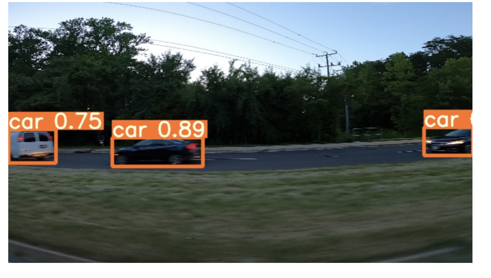

# Research_Methodology

This is a README file indicating the use of this repository


## Name of the Project
- Performing Multiple Object Detection in a Single Frame

## Description
- Using remote sensing photos to detect changes is becoming more popular as remote sensing technology advances. 
This project deals with the current state of research in pixel-based and object-based change detection technology, as well as many change detection methodologies.
This research tries to complete the multiple object detection through the method YOLO (You Only Look Once).

## Installation
- To run this project, all you need to have is a notebook account(Google Colab/ Azure Notebook/ Jupyter etc). 
- Once the acoounts are up and active, a connection to Google Drive is recommended to use the Dataset.
- Then, import all the libraries and the gitclones that are required to run the model.

### Gitclone to be imported

```bash

!git clone https://github.com/ultralytics/yolov5  # clone repo
!pip install -U pycocotools
!pip install -qr yolov5/requirements.txt  # install dependencies
!cp yolov5/requirements.txt ./

```

## Usage
- When all the required resources are imported and cloned, change the path of the dataset to the path that dataset is present in.
- Then run the blocks of code until the section before *checking the image*
- In this section change the path to the image that you want to check (any random image)
- When the code is complete, you will see the result like this



- If you find the rectangle over the object recognizing it as a vehicle, the program is run successfully.

## Support
- You can get hold of me via email- [email me](adeshpa2@lakeheadu.ca)  or via my twitter  

## Road-map
- For the future work, the vehicle object detection can be tried to improved with the live cameras data and also trying to track down on the multiple formats of objects that are wanted to be captured.
- Real-time implementation is obviously better for future development. As a result, we can use the FPGA platform to construct this method.


